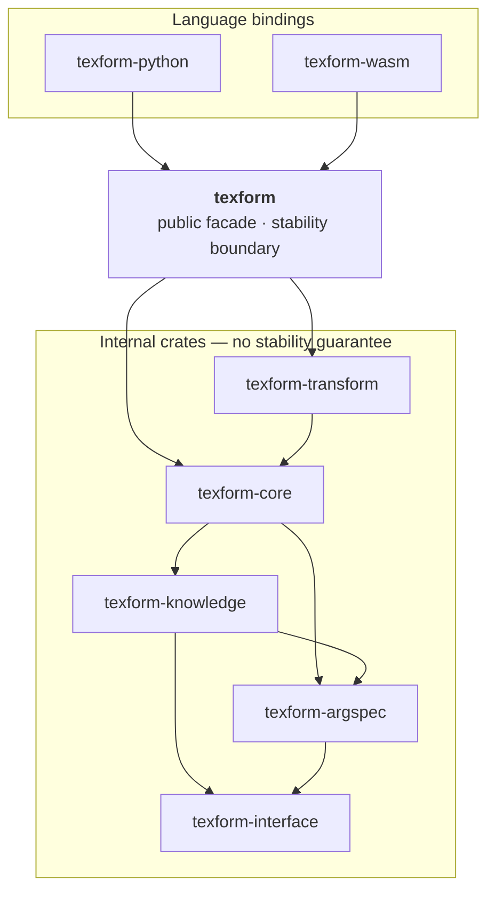

# TeXForm Architecture

TeXForm is a LaTeX formula parser, serializer, and transform engine. This document explains how the pieces fit together: the crate layout and where the stability boundary sits, the processing pipeline a formula travels through, the three tree representations and why they are distinct, and the invariants that the public API guarantees. It is the map to read before diving into any single module.

For end-user usage and runnable examples, see [`README.md`](README.md). For contributor conventions, see [`AGENTS.md`](AGENTS.md). This file covers the *why* of the structure, not the *how* of any individual feature.

## Crate Layout and the Stability Boundary

TeXForm is a Rust workspace of small, single-purpose crates. Only one of them — `texform` — carries a public stability guarantee. Every other crate is an internal implementation detail whose API may change without notice; external code must integrate through the `texform` facade.



Arrows point from a crate to the crates it depends on. Everything below `texform` is internal; the facade is the only crate external code may depend on.

| Crate | Responsibility |
|-------|----------------|
| `texform` | Public facade. Re-exports the stable surface: `Parser`, `TransformEngine`, `Document`, `ParseResult`, serialization, `validate_argspec`, analysis helpers. The only crate other code should depend on. |
| `texform-core` | The parser, the internal `Ast` arena, the canonical serializer, and the public `Document` DOM layer. |
| `texform-transform` | The phase-oriented rewrite/normalization engine that operates on a parsed tree. |
| `texform-knowledge` | The command and environment knowledge base: which names are known, and what argument shapes they take. |
| `texform-argspec` | An xparse-style argument-specification parser used to describe command signatures. |
| `texform-interface` | Dependency-free shared types, most importantly `SyntaxNode`, the lossless parse snapshot. |
| `texform-python`, `texform-wasm` | Language bindings layered strictly on top of the `texform` facade. |
| `texform-regression` | Corpus regression and data-product tooling for parser regression and counter-map generation. Internal tooling, not part of the public API. |

The facade deliberately does **not** re-export the internal `Ast`, `Node`, or arena types. Users get a single editable tree type — `Document` — and never touch the panic-contract arena underneath it.

## The Processing Pipeline

A formula flows through the system in one direction, with three distinct output channels at the end:

```text
LaTeX source
  │  Parser (chumsky-based, consults the knowledge base for command signatures)
  ▼
SyntaxNode                  immutable, lossless parse snapshot (may contain Error nodes)
  │  Document::from_syntax  (the parser-driven path also carries source spans across)
  ▼
Document                    public, editable DOM; wraps an internal Ast arena
  │
  ├─ to_latex()             serialize back to LaTeX text (Error nodes round-trip their snippet)
  ├─ TransformEngine::transform()    normalize via the transform engine (gated on a complete tree)
  └─ to_syntax()            convert back to a SyntaxNode for serde / transport
```

The parser produces a `SyntaxNode` first. TeXForm then converts that snapshot into a `Document`, which is the tree users read, edit, serialize, and transform. `SyntaxNode` is never edited directly; it is the wire format, and `Document` is the working format.

## Three Tree Representations

The same formula is modeled by three trees with deliberately separated roles. Confusing them is the most common source of design mistakes, so the boundaries are explicit:

- **`SyntaxNode`** (`texform-interface`) is the lossless, immutable parse snapshot. It is the parser's stage-1 output and the single serde DTO — it derives `Serialize`/`Deserialize` and backs JSON snapshots, Python dictionaries, JavaScript objects, and test fixtures. It can represent a partial parse (it may contain `Error` nodes) but carries no editing behavior.
- **`Document`** (`texform-core`, re-exported by the facade) is the public, editable DOM-style tree. It is what users construct, query, mutate, serialize, and transform. Reads go through lightweight `NodeRef` handles; edits are fallible and return `Result<_, EditError>`.
- **`Ast`** is the internal arena tree (`HopSlotMap` nodes plus a parent-link map) that the transform engine and serializer operate on. It is a *panic-contract* type: its methods panic on misuse because misuse means an internal invariant was violated, not that a user supplied bad input. It is **not** part of the public API. `Document` wraps it and exposes a fallible surface over it, so no arena panic can reach a caller on a user-input-driven path.

`Document::from_syntax` / `Document::to_syntax` bridge the snapshot and the working tree in both directions, and the conversion is symmetric over every node kind, including `Error` and `Prime`. `Prime { count }` represents one or more consecutive math prime marks from source-level quote shorthand. `count` must be greater than zero, and `Prime` is valid only in math-mode content; `Document::from_syntax` rejects invalid external syntax with `FromSyntaxError` instead of letting the internal arena panic.

The parser keeps source-level prime forms distinct. Quote tokens such as `f'`, `f''`, and `f^{'}` become `Prime` nodes, while the control sequence `\prime` remains a normal `Command("prime")` after parsing. Normalization may rewrite that command into `Prime`, but the parser does not erase the difference by itself.

## Structural Validity vs. Semantic Completeness

Two notions of "valid" are kept strictly apart, because they answer different questions:

- **Structural validity** is about the shape of the arena: parent links are consistent, slots hold the right node kinds, an environment body is a group, the root is unique and parentless, and there are no cycles. `Ast` and `Document` maintain structural validity **at all times**. Crucially, promoting parse errors to first-class `Error` *leaves* means a tree containing errors is still structurally valid.
- **Semantic completeness** is about whether the tree contains any `Error` placeholder nodes. This is a separate, O(1)-queryable property exposed by `Document::has_errors()` — not a structural invariant. `Document::errors()` enumerates the offending nodes.

The method is named for the concrete fact it reports (`has_errors()`), not an abstract `is_complete()`, so read-only checks and transform gates read without a double negative.

This mirrors MathJax: its rendered MathML embeds `mjx-error` nodes for unparseable fragments, the output tree stays structurally well-formed, and the renderer simply handles the error nodes. TeXForm takes the same approach — `Error` is a first-class node kind, the tree is always structurally valid, and "does it contain errors" is a cheap signal downstream consumers can check without validating the whole tree.

## Parse Result States

`Parser::parse` returns a `ParseResult` carrying an optional document plus diagnostics. There are exactly three honest states — TeXForm never fabricates a placeholder tree to pretend a document always exists:

| State | Shape | Meaning |
|-------|-------|---------|
| `None` | no tree | The parser produced nothing; the failure is described entirely by `diagnostics`. |
| `Some` + `!has_errors()` | complete, editable tree | A clean parse. Also covers the empty formula and from-scratch construction (`Document::new()`). |
| `Some` + `has_errors()` | partial, read-only tree | Recovery preserved the unparseable parts as `Error` placeholders. |

- **Empty input is not an error and not `None`.** `""` parses to a `Document` holding a single empty root — the exact same legal state as `Document::new()`.
- **`None` is reserved for a hard failure with no tree to return.** It is never a synthesized `Root → Error` fallback.

Within a parser-produced `ParseResult`, `has_errors()` implies a non-empty `diagnostics` list: every recovery `Error` node is emitted alongside at least one diagnostic. The converse does not hold — diagnostics can exist without any `Error` node (for example, unknown-command diagnostics under lenient parsing). This implication is a property of the *parser path only*, not a global invariant: `Document::from_syntax` can build a tree that `has_errors()` but has no diagnostics channel at all.

## Error Nodes and `abort_on_error`

Recovery `Error` nodes are produced only when `abort_on_error == false` (lenient parsing, which keeps collecting diagnostics). Under strict parsing (`abort_on_error == true`), the parser stops at the first error per item and produces no recovery `Error` nodes — with a single exception: the max-group-depth guard emits an `Error` node unconditionally.

Therefore `abort_on_error` and `Document::has_errors()` must not be treated as equivalent in either direction. One is a parse-strictness knob; the other is a property of the resulting tree.

`Error` nodes may appear in any ordinary node position (a group child, a command argument, a script slot). They are opaque leaves: the transform engine never rewrites them, and `to_latex()` re-emits their captured source snippet verbatim so a partial tree round-trips losslessly.

## Editing Model

All user-facing editing goes through `Document` and is fallible by design:

- **Reads use `NodeRef` handles.** `NodeRef` is a read-only borrow that carries no editing methods, so `&Document` reads cannot conflict with `&mut Document` edits. Navigation (`parent`, `children`, `next_sibling`, `ancestors`, ...) and content accessors return `NodeRef`s and typed views (`ArgRef`, `DelimiterRef`, `GroupKindRef`).
- **Edits return `Result<_, EditError>`.** Mutations are validated eagerly and report a structured error at the point of misuse rather than deferring to a final whole-tree validation pass. Nodes are built with `create_*` methods that stage detached subtrees, then attached with `append_child`, `insert_before`, `wrap`, and friends.
- **No panic ever escapes to the caller.** `Document` validates ownership, container shape, root protection, cycles, and slot shape before touching the panic-contract arena, mapping each failure to an `EditError` variant.
- **Cross-document mixing is rejected.** A `NodeId` carries the identity of its owning document, so an edit referencing a node from another document fails with `EditError::ForeignNode` instead of silently corrupting an unrelated tree.
- **Trees with errors are read-only.** If `has_errors()`, every editing method returns `EditError::ReadOnlyDocument`. Read-only-ness is fixed at construction; since the tree cannot be edited, its error count cannot change. The only use case for an error tree is inspection, so this keeps the contract simple.

## Serialization and Serde

`Document` has two distinct output channels, named to avoid the ambiguity of a generic "serialize":

- **`to_latex()` / `to_latex_with(&SerializeOptions)`** render the tree back to LaTeX *text* using the canonical serializer. There is intentionally no method named `serialize` on `Document`.
- **`to_syntax()`** converts the tree to a `SyntaxNode`, which is the single serde DTO. `Document` and `Ast` do not implement serde directly; structured-data output always goes through `SyntaxNode`.

The serializer covers the full node vocabulary, including emitting an `Error` node's snippet and writing `Prime` nodes back as quote shorthand. A pure prime superscript serializes compactly as `f'` or `f''`; mixed superscripts such as `f'^2` remain ordinary script groups. The serializer guarantees text idempotency (see the README's serialization section for the exact contract and the configurable style axes).

## Transform Engine

`texform-transform` normalizes a parsed tree so downstream consumers — formula equivalence, MER tokenization, LLM pretraining corpora, polished authoring output — share a stable canonical form. The engine runs ordered phases: pre-rewrite LowerAttributes, a fixed-point Rewrite loop, post-rewrite LowerAttributes, FinalizeAst, then FlattenGroups. A `Profile` selects normalization levels, where a level is the first profile that accepts a rule's output as a suitable product. A rule's render fidelity is a separate, orthogonal guarantee that does not determine its level. `TransformConfig` controls per-run switches. See the README and the rule-authoring docs for the phase and profile catalog.

`FinalizeAst` is the phase for local AST cleanup that does not depend on rewrite metadata. Its first responsibility is merging adjacent `Prime` nodes produced by rewrite rules, so `f^{\prime\prime}` can normalize through `Prime(1), Prime(1)` into the same final shape as `f''`. It is enabled by default in every public profile and can be disabled with `TransformConfig.finalize_ast.enabled` in Rust, `finalize_ast` in Python, or `finalizeAst` in JavaScript options.

Normalization is **gated on a complete tree**: `TransformEngine::transform` and `TransformEngine::normalize` return `Error::IncompleteTree` when `document.has_errors()`, because normalizing a tree with holes is meaningless. An empty document is complete (`!has_errors()`) and normalizes normally.

The Rust transform report returned by the `texform` facade is phase-oriented: `report.rewrite.iterations` / `report.rewrite.rules`, `report.finalize_ast.steps.merge_adjacent_primes`, `report.flatten_groups.actions` / `report.flatten_groups.guards`, and `report.lower_attributes.attributes` plus `eliminated_empty_segments`. Python and WebAssembly expose the same data through a transport DTO with top-level `iterations` and `rules[]`; Python keeps snake_case fields such as `finalize_ast`, while JavaScript uses `finalizeAst` for the public option/report shape.

Rewrite rules may declare forms they eliminate. When Rewrite is enabled, the engine checks that eliminated-form contract only after the full pipeline has completed, including post-rewrite LowerAttributes, FinalizeAst, and FlattenGroups. A remaining eliminated form is a hard transform error, surfaced as a contract violation rather than a warning.

## Knowledge and Argument Specifications

The parser is not purely syntactic — it consults `texform-knowledge` to decide whether a command or environment name is *known* and what argument shape it takes. Argument shapes are described in an xparse-style signature language parsed by `texform-argspec` (mandatory, optional, delimited, starred, and similar argument kinds). Unknown names are handled per `ParseConfig::reject_unknown`: either turned into diagnostics, or preserved as `known: false` nodes for lenient exploration. This is why parsing depends on a knowledge layer beneath the core parser, and why the same source can parse differently under different configurations.

## Language Bindings

The Python and WebAssembly bindings expose live `Document` and `Node` handles rather than copying trees across the language boundary:

- A binding `Node` is a cheap handle — a shared reference to its owning document plus a `NodeId`. All reads and edits delegate back to the document; the tree is never cloned.
- The core `Document` stays a plain owned Rust value with no interior mutability. Sharing is provided only at the binding layer, using each runtime's native mechanism: PyO3's reference-counted pyclass cell on Python, and `Rc<RefCell<…>>` on WASM. Direct Rust users never pay for the bindings' sharing needs.
- Borrow conflicts and misuse surface as structured host-language exceptions, never as a panic crossing the FFI boundary. A read-only (error) document raises a read-only exception, and an edit mixing nodes from two documents is rejected before reaching the core (mapping `ForeignNode` to a cross-document exception).
- `texform::bindings` is an internal DTO support layer for reports, lookup metadata, argspec validation, and binding error metadata. Rust DTO fields use snake_case as the canonical form; Python exposes that form directly, while WASM provides the JavaScript camelCase view.
- `SyntaxNode` is not part of binding casing conversion. It remains the single tree wire format across Rust serde, Python dictionaries, JavaScript objects, and JSON fixtures.

The result is a consistent editing model across Rust, Python, and JavaScript, built on one core implementation rather than three hand-written copies.
