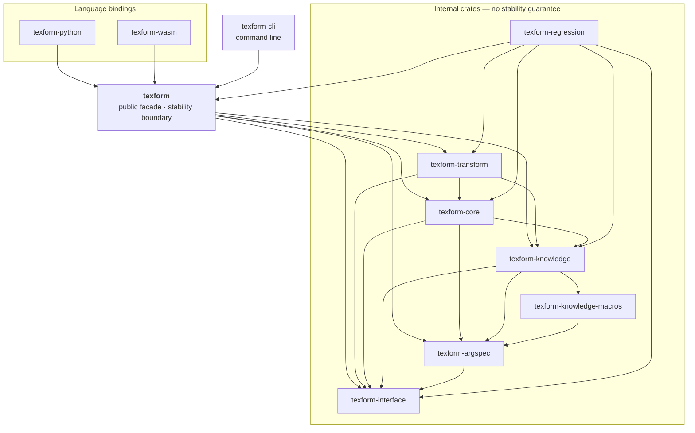

# TeXForm Architecture

TeXForm is a LaTeX formula parser, serializer, and transform engine. This document defines crate boundaries, tree representations, and public API invariants. Subsystem READMEs explain local behavior; source doc comments define exact fields and implementation details.

## Crate Layout and the Stability Boundary

TeXForm is a Rust workspace of small, single-purpose crates. Only one of them — `texform` — carries a public stability guarantee. Every other crate is an internal implementation detail whose API may change without notice; external code must integrate through the `texform` facade.


```mermaid
graph TD
    subgraph bindings["Language bindings"]
        py["texform-python"]
        wasm["texform-wasm"]
    end

    cli["texform-cli<br/>command line"]

    facade["<b>texform</b><br/>public facade · stability boundary"]

    subgraph internal["Internal crates — no stability guarantee"]
        transform["texform-transform"]
        core["texform-core"]
        knowledge["texform-knowledge"]
        knowledge_macros["texform-knowledge-macros"]
        argspec["texform-argspec"]
        interface["texform-interface"]
        regression["texform-regression"]
    end

    py --> facade
    wasm --> facade
    cli --> facade
    facade --> transform
    facade --> core
    facade --> knowledge
    facade --> argspec
    facade --> interface
    transform --> core
    transform --> knowledge
    transform --> interface
    core --> knowledge
    core --> argspec
    core --> interface
    knowledge --> argspec
    knowledge --> knowledge_macros
    knowledge --> interface
    knowledge_macros --> argspec
    argspec --> interface
    regression --> facade
    regression --> transform
    regression --> core
    regression --> knowledge
    regression --> interface
```

Arrows point from a crate to the crates it depends on. Everything below `texform` is internal; the facade is the only general-purpose Rust crate external code should depend on. The binding crates are published language surfaces, but they may still depend on internal helper crates for host-language glue such as generated TypeScript shapes and option conversion. `texform-cli` is a front end like the bindings but depends on the facade alone; as a separate crate, it keeps command-line dependencies out of the library's dependency graph.

| Crate | Responsibility |
|-------|----------------|
| `texform` | Public facade. Re-exports the stable surface: `Parser`, `TransformEngine`, `Document`, `ParseResult`, serialization, `validate_argspec`, analysis helpers, and package metadata. The only general-purpose Rust crate other code should depend on. |
| `texform-core` | The parser, the internal `Ast` arena, the canonical serializer, and the public `Document` DOM layer. |
| `texform-transform` | The phase-oriented rewrite/normalization engine that operates on a parsed tree. |
| `texform-knowledge` | The command and environment knowledge base: which names are known, and what argument shapes they take. |
| `texform-knowledge-macros` | Procedural macros used by the knowledge base, including compile-time argument-specification parsing for generated records. |
| `texform-argspec` | An xparse-style argument-specification parser used to describe command signatures. |
| `texform-interface` | Shared types with no dependencies on other TeXForm crates, most importantly `SyntaxNode`, the lossless parse snapshot. |
| `texform-python`, `texform-wasm` | Language bindings that expose the shared facade model to Python and WebAssembly. |
| `texform-cli` | The `texform` command-line tool: normalization, parsing, tokenization, knowledge queries, argspec validation, and the `serve` normalizer protocol for other processes. It shares the bindings' DTOs and config overlays through the facade. |
| `texform-regression` | Corpus regression and data-product tooling for parser regression, transform-contract checking, and counter-map generation. Internal tooling, not part of the public API. |

The facade deliberately does **not** re-export the internal `Ast`, `Node`, or arena types. Users get a single editable tree type — `Document` — and never touch the panic-contract arena underneath it. Hidden research and test entries may still be callable on the facade; they are omitted from the public rustdoc and carry no compatibility promise.

## The Processing Pipeline

A formula flows through parsing into an editable document, with separate operations for text output, tokenized output, transformation, and syntax snapshots:

```text
LaTeX source
  │  Parser (chumsky-based, consults the knowledge base for command signatures)
  ▼
SyntaxNode                  immutable, lossless parse snapshot (may contain Error nodes)
  │  Document::from_syntax  (the parser-driven path also carries source spans across)
  ▼
Document                    public, editable DOM; wraps an internal Ast arena
  │
  ├─ to_latex()             serialize back to LaTeX text (Error nodes round-trip their snippet)
  ├─ to_tokenized_latex()   serialize once to canonical text plus typed output tokens
  ├─ TransformEngine::transform()    normalize via the transform engine (gated on a complete tree)
  └─ to_syntax()            convert back to a SyntaxNode for serde / transport
```

The parser produces a `SyntaxNode` first. TeXForm then converts that snapshot into a `Document`, which is the tree users read, edit, serialize, and transform. `SyntaxNode` is never edited directly; it is the wire format, and `Document` is the working format.

## Three Tree Representations

The same formula is modeled by three trees with deliberately separated roles. Confusing them is the most common source of design mistakes, so the boundaries are explicit:

- **`SyntaxNode`** (`texform-interface`) is the lossless, immutable parse snapshot. It is the parser's stage-1 output and the single serde DTO — it derives `Serialize`/`Deserialize` and backs JSON snapshots, Python dictionaries, JavaScript objects, and test fixtures. It can represent a partial parse (it may contain `Error` nodes) but carries no editing behavior.
- **`Document`** (`texform-core`, re-exported by the facade) is the public, editable DOM-style tree. It is what users construct, query, mutate, serialize, and transform. Reads go through lightweight `NodeRef` handles; edits are fallible and return `Result<_, EditError>`.
- **`Ast`** is the internal arena tree (`SlotMap` nodes plus a parent-link map) that the transform engine and serializer operate on. It is a *panic-contract* type: its methods panic on misuse because misuse means an internal invariant was violated, not that a user supplied bad input. It is **not** part of the public API. `Document` wraps it and exposes a fallible surface over it, so no arena panic can reach a caller on a user-input-driven path.

`Document::from_syntax` / `Document::to_syntax` bridge the snapshot and the working tree in both directions, and the conversion is symmetric over every node kind, including `Error` and `Prime`. `Prime { count }` represents consecutive prime symbols in the current math list; only `Scripted` establishes superscript binding. `count` must be greater than zero, and `Prime` is valid only in math-mode content; `Document::from_syntax` rejects invalid external syntax with `FromSyntaxError` instead of letting the internal arena panic.

The parser keeps source-level prime forms distinct. Quote tokens create `Scripted` nodes with `Prime` in the superscript slot; a leading quote has an empty group as its base, including inside `f^{'}`. Whitespace-separated quote tokens can contribute to one `Prime { count }` superscript. The control sequence `\prime` remains a normal `Command("prime")` after parsing. Normalization may rewrite that command into the symbol node without changing script binding.

## Structural Validity vs. Semantic Completeness

Two notions of "valid" are kept strictly apart, because they answer different questions:

- **Structural validity** is about the shape of the arena: parent links are consistent, slots hold the right node kinds, an environment body is a group, the root is unique and parentless, and there are no cycles. `Ast` and `Document` maintain structural validity **at all times**. Crucially, promoting parse errors to first-class `Error` *leaves* means a tree containing errors is still structurally valid.
- **Semantic completeness** is about whether the tree contains any `Error` placeholder nodes. This is a separate, O(1)-queryable property exposed by `Document::has_errors()` — not a structural invariant. `Document::errors()` enumerates the offending nodes.

## Parse Result States

`Parser::parse` returns a `ParseResult` carrying an optional document plus diagnostics. There are exactly three honest states — TeXForm never fabricates a placeholder tree to pretend a document always exists:

| State | Shape | Meaning |
|-------|-------|---------|
| `None` | no tree | The parser produced nothing; the failure is described entirely by `diagnostics`. |
| `Some` + `!has_errors()` | complete, editable tree | A clean parse. Also covers the empty formula and from-scratch construction (`Document::new()`). |
| `Some` + `has_errors()` | partial, read-only tree | Recovery preserved the unparseable parts as `Error` placeholders. |

- **Empty input is not an error and not `None`.** `""` parses to a `Document` holding a single empty root — the exact same legal state as `Document::new()`.
- **`None` is reserved for a hard failure with no tree to return.** It is never a synthesized `Root → Error` fallback.

Within a parser-produced `ParseResult`, `has_errors()` implies a non-empty `diagnostics` list: every recovery `Error` node is emitted alongside at least one diagnostic. The converse does not hold — diagnostics and `Error` placeholders are separate channels, so a diagnostic does not by itself make an otherwise editable tree read-only. This implication is a property of the *parser path only*, not a global invariant: `Document::from_syntax` can build a tree that `has_errors()` but has no diagnostics channel at all.

See the [parser diagnostics implementation](crates/texform-core/src/parse/diagnostics.rs) for conversion to public diagnostics and source-position handling.

## Error Nodes and `abort_on_error`

Recovery `Error` nodes are produced only when `abort_on_error == false` (lenient parsing, which keeps collecting diagnostics). Under strict parsing (`abort_on_error == true`), the parser stops at the first error per item and produces no recovery `Error` nodes — with a single exception: the max-group-depth guard emits an `Error` node unconditionally.

Therefore `abort_on_error` and `Document::has_errors()` must not be treated as equivalent in either direction. One is a parse-strictness knob; the other is a property of the resulting tree.

`Error` nodes may appear in any ordinary node position (a group child, a command argument, a script slot). They are opaque leaves: the transform engine never rewrites them, and `to_latex()` re-emits their captured source snippet verbatim so a partial tree round-trips losslessly.

## Editing Model

All user-facing editing goes through `Document` and is fallible by design:

- **Reads use `NodeRef` handles.** `NodeRef` is a read-only borrow that carries no editing methods, so `&Document` reads cannot conflict with `&mut Document` edits. Navigation (`parent`, `children`, `next_sibling`, `ancestors`, ...) and content accessors return `NodeRef`s and typed views (`ArgRef`, `DelimiterRef`, `GroupKindRef`).
- **Edits return `Result<_, EditError>`.** Mutations are validated eagerly and report a structured error at the point of misuse rather than deferring to a final whole-tree validation pass. Nodes are built with `create_*` methods that stage detached subtrees, then attached with `append_child`, `insert_before`, `wrap`, and friends.
- **No panic ever escapes to the caller.** `Document` validates ownership, container shape, root protection, cycles, and slot shape before touching the panic-contract arena, mapping each failure to an `EditError` variant.
- **Cross-document mixing is rejected.** A `NodeId` carries the identity of its owning document, so an edit referencing a node from another document fails with `EditError::ForeignNode` instead of silently corrupting an unrelated tree.
- **Trees with errors are read-only.** If `has_errors()`, every editing method returns `EditError::ReadOnlyDocument`. Read-only-ness is fixed at construction; since the tree cannot be edited, its error count cannot change. The only use case for an error tree is inspection, so this keeps the contract simple.

## Serialization and Serde

`Document` has three distinct output channels, named to avoid the ambiguity of a generic "serialize":

- **`to_latex()` / `to_latex_with(&SerializeOptions)`** render the tree back to LaTeX *text* using the canonical serializer. There is intentionally no method named `serialize` on `Document`.
- **`to_tokenized_latex()` / `to_tokenized_latex_with(&SerializeOptions)`** run the same canonical serializer traversal with an opt-in recorder, returning the identical LaTeX plus typed output fragments.
- **`to_syntax()`** converts the tree to a `SyntaxNode`, which is the single serde DTO. `Document` and `Ast` do not implement serde directly; structured-data output always goes through `SyntaxNode`.

The serializer covers the full node vocabulary, including emitting an `Error` node's snippet. An ordinary `Prime` emits `\prime` symbols, while a direct pure-prime `Scripted` superscript emits quote shorthand such as `f'` or `f''`; a mixed superscript such as `f'^2` emits `f^{\prime 2}`, and an empty script base remains explicit. A `Group(Prime)` superscript emits `^{\prime}` even without FlattenGroups. It is a canonical printer over the AST, not a semantic recovery layer: node-specific emitters and `SerializeOptions` may choose a textual form, but they must not reconstruct missing semantics from a concrete command name or source spelling. Information needed for correct output belongs in the AST first; examples include content mode, operator-name content, and tight argument boundaries. Wrappers that carry no distinct semantics must not make the emitted source acquire a different meaning.

The serializer guarantees **text idempotency** — `serialize(parse(serialize(parse(src)))) == serialize(parse(src))`: parsing the canonical output and re-serializing always produces the same string. This is a text-level guarantee; `parse(serialize(ast))` is not required to recover the exact same AST kind. Output style is configurable through `SerializeOptions` (see the [`texform` API docs](https://docs.rs/texform) for the option axes).

Control-word separation follows the ASCII lexer and is distinct from optional math spacing. A backslash plus consecutive ASCII letters is a control word; a backslash plus one non-letter is a control symbol. The serializer inserts a separator only when the emitted text still ends in an unterminated control word and the next character is an ASCII letter that would extend that name. `CommandSpacing::Minimal`, compact groups, suppressed optional boundaries, and text mode cannot drop that space. A control symbol, or a following digit, whitespace, `*`, or structural delimiter, already terminates the name. Text mode adds no other spaces, and existing text whitespace stays in its text token. Math mode still applies the optional `SerializeOptions` rules, so removing a false control-symbol separator does not compact math output. In tokenized output the required separator is a gap between tokens; the space inside a control symbol such as `\ ` stays inside that control-sequence token. Empty emissions do not clear this boundary.

Tokenized output records typed fragments with semantic math/text modes and UTF-8 byte spans into the canonical string. Token categories and boundaries are part of the stable facade contract, defined in the [`TokenizedLatex` and `SerializationToken` API documentation](crates/texform-core/src/serialize.rs). These are serializer-owned boundaries, not lexer or model tokens. Text and tokenized output share one traversal and spacing policy; ordinary text serialization does not allocate token records.

## Transform Engine

The engine compiles a rewrite plan from a profile and the active knowledge base, then runs deterministic phase rounds to a common fixed point over the document's internal AST. A phase mutation invalidates the other phases; phases already current are skipped. An internal eight-round budget reports non-convergence as an error. LowerAttributes handles attribute markers, Rewrite handles rule-driven normalization, FinalizeAst canonicalizes representation, and FlattenGroups removes redundant groups. Per-run configs gate phases without changing the selected rule set. The [transform reference](crates/texform-transform/README.md#pipeline) defines execution order, profile defaults, fidelity, and phase reports.

`normalize` and `normalize_with` return the normalized string. `transform` and `transform_with` normalize a document in place and return `()`. Diagnostic counters are opt-in: `normalize_with_report` and `transform_with_report` take the same config types as the plain methods and return [`diagnostics::NormalizeReportResult`](crates/texform/src/diagnostics.rs) or [`diagnostics::TransformReport`](crates/texform/src/diagnostics.rs). There is no default-config overload for the report methods; callers pass the engine's default config accessors. Report fields, phase divisions, and detailed statistics are diagnostic and are not part of the stable compatibility promise. Output text and errors follow the ordinary transform contract. The hidden research entries `normalize_with_flatten_groups_guards` and `transform_with_flatten_groups_guards` keep their names and always collect a report.

[`diagnostics`](crates/texform/src/diagnostics.rs) is the facade home for `TransformReport` and the phase report types, including attribute value types carried by the LowerAttributes report. Phase config types such as `FinalizeAstConfig` stay on the crate root. A report is owned by one call: the engine does not store it, and a failed call does not return a partial report.

LowerAttributes reads prefix and declarative targets from the attribute map. Prefix-backed values become wrappers; declarative-only values keep a local group, and following siblings resume the prior state. The phase does not synthesize default style or size commands.

Normalization requires a complete tree: `TransformEngine::transform` and `normalize` return `Error::IncompleteTree` when `document.has_errors()`. Empty input is complete and normalizes normally. In-place transformation also requires a document produced by that engine's parser; documents from another parser or `Document::from_syntax` produce `Error::ForeignDocument`. Requesting a report does not relax those checks.

When Rewrite is enabled, declared eliminated forms are checked after all enabled mutation phases. This final validation is read-only; a remaining eliminated form is a transform error. The [rule authoring guide](crates/texform-transform/src/rewrite/rules/README.md#metadata-and-the-rewrite-contract) defines the metadata contract.

## Knowledge and Argument Specifications

The parser is not purely syntactic — it consults `texform-knowledge` to decide whether a command or environment name is *known* and what argument shape it takes. Argument shapes are described in an xparse-style signature language parsed by `texform-argspec` (mandatory, optional, delimited, starred, and similar argument kinds). Unknown names are handled per `ParseConfig::reject_unknown`: either turned into diagnostics, or preserved as `known: false` nodes for lenient exploration. This is why parsing depends on a knowledge layer beneath the core parser, and why the same source can parse differently under different configurations.

## Language Bindings

The Python and WebAssembly bindings expose live `Document` and `Node` handles rather than copying trees across the language boundary:

- A binding `Node` is a cheap handle — a shared reference to its owning document plus a `NodeId`. All reads and edits delegate back to the document; the tree is never cloned.
- The core `Document` stays a plain owned Rust value with no interior mutability. Sharing is provided only at the binding layer, using each runtime's native mechanism: PyO3's reference-counted pyclass cell on Python, and `Rc<RefCell<…>>` on WASM. Direct Rust users never pay for the bindings' sharing needs.
- Borrow conflicts and misuse surface as structured host-language exceptions, never as a panic crossing the FFI boundary. A read-only (error) document raises a read-only exception, and an edit mixing nodes from two documents is rejected before reaching the core (mapping `ForeignNode` to a cross-document exception).
- `texform::bindings` shares DTOs, config overlays, and strict input validation. Rust uses snake_case; WASM converts host-facing fields and error paths to camelCase. Host conversion stays at the boundary. The [Python](python/texform/README.md#python-specific-notes) and [JavaScript](packages/texform/README.md#javascript-specific-notes) guides define their distinct config calling conventions.
- Plain `normalize` returns text and plain `transform` returns no value in both bindings. `normalize_with_report` / `transform_with_report` (Python) and `normalizeWithReport` / `transformWithReport` (JavaScript) are the paths that convert the shared diagnostic DTO. They reuse the ordinary config parsers. Report fields are diagnostic and are not a stable compatibility promise. The Python research entry `_normalize_with_flatten_groups_guards` keeps its name and always returns a report; JavaScript has no guard-overlay entry.
- Tokenized serialization uses the same DTO conversion from the owning Rust result in both bindings; Python exposes `start_byte` / `end_byte`, while JavaScript exposes `startByte` / `endByte`. All are UTF-8 byte offsets rather than Python code-point or JavaScript UTF-16 indices, and neither binding re-tokenizes the LaTeX string.
- `SyntaxNode` is not part of binding casing conversion. It remains the single tree wire format across Rust serde, Python dictionaries, JavaScript objects, and JSON fixtures.
